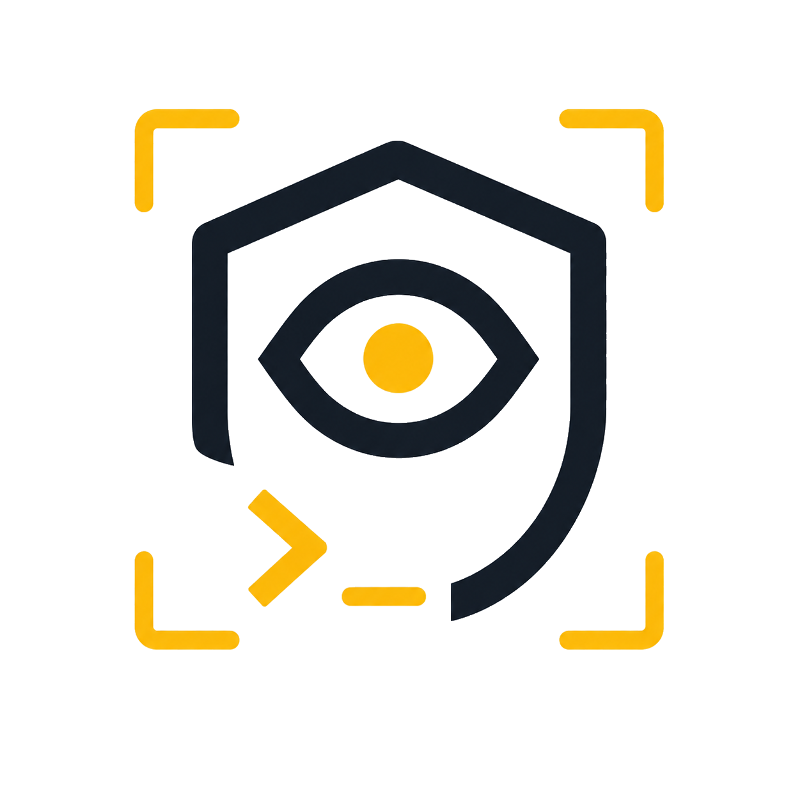

<p align="center">
  
</p>

# Supargus

Supargus is a free, open-source privacy removal app that runs from your own machine.

It is the "scan, review, remove, and keep receipts" workflow people expect from a consumer privacy service, but without uploading your identity profile to another middleman. You get a native desktop app, a CLI for power users, local identity storage, reviewed email sending, manual opt-out form queues, recurring scans, evidence bundles, and a watchdog for proxy or bandwidth-sharing software you may not know is installed.

No account. No subscription. No silent sending.

## Why It Exists

Your personal data is not just "out there." It is searched, enriched, sold, reused, and sometimes routed through infrastructure that ordinary users never knowingly opted into.

Commercial removal services can be useful, but they ask for the exact data you are trying to protect: legal name, aliases, emails, phone numbers, addresses, relatives, and permission to contact brokers for you.

Supargus takes the opposite stance:

- keep the identity profile local
- show evidence before action
- generate requests you can inspect
- send from accounts you control
- track every broker response
- re-check when data reappears
- scan your own machine for proxy and bandwidth-sharing signals
- make cloud AI optional, never required

## The App

`supargus app` opens a real desktop application window, not a localhost browser tab.

The desktop flow is intentionally plain:

1. Dashboard: see your privacy score and the next recommended action.
2. Guide: walk through the first privacy check and reviewed cleanup action.
3. Cleanup: scan data brokers, separate verified/likely hits from request-only brokers, and prepare removal drafts.
4. This PC: review local proxy, extension, startup, and bandwidth-sharing signals.
5. Removals: handle manual opt-out forms and custom removal URLs.
6. Advanced: use CLI-grade actions, paths, logs, and setup controls.

Everything is review-first. Email requests can be previewed before sending, form submissions stay manual, and evidence bundles are created locally.

## What Scan Means

Supargus follows the same broad shape as commercial data-removal services, but keeps the control local:

- public people-search sites are checked with lightweight HTTP searches when you run the desktop app
- aliases, secondary emails, secondary phones, usernames, and address history are included in the matcher
- private broker databases are marked as request-only because they often cannot be searched directly
- takedown drafts, form tasks, tracker records, follow-ups, and receipt bundles are generated on your machine
- email sending still requires explicit review

Incogni describes a similar split: it scans people-search sites where records can be found, then sends opt-out requests to brokers that may hold private database records. Supargus is not trying to be a middleman for that. It is trying to give you the local workflow.

## Removal Progress

When requests are prepared or imported into the tracker, Supargus now gives each request a local request ID and timeline:

- draft created
- request submitted
- follow-up window
- removal confirmed

The tracker also stores the specific identifiers requested for removal and the next follow-up date. This makes the app feel closer to a removal-service dashboard while keeping the records local.

## Local Action Plan

After a guided scan or workflow run, Supargus writes `workspace/action_plan.json`. The plan groups the next steps into:

- verified scan findings to review
- request-only brokers where private databases cannot be searched directly
- email drafts ready for preview
- manual opt-out forms to complete
- follow-ups that are due

This is the local equivalent of a removal-service dashboard queue: it tells you what can be automated, what needs review, and what must remain manual.

The `Automate safe steps` action prepares drafts, builds manual form tasks, imports tracker records, generates due follow-ups, rebuilds the action plan, and exports a receipt bundle. It does not send email or submit broker forms.

## Quick Start

```bash
git clone https://github.com/lachydotmcg/supargus.git
cd supargus
python -m venv .venv
source .venv/bin/activate
pip install -e .
supargus init workspace/identity.example.json
supargus app --workspace workspace
```

Windows PowerShell:

```powershell
git clone https://github.com/lachydotmcg/supargus.git
cd supargus
python -m venv .venv
.\.venv\Scripts\activate
pip install -e .
supargus init workspace\identity.example.json
supargus app --workspace workspace
```

On Windows installs, `supargus-app` is also exposed as a GUI launcher.

To create Start Menu or desktop shortcuts:

```powershell
supargus shortcut install --workspace workspace
```

## Core Capabilities

| Area | What Supargus Does |
| --- | --- |
| Identity Vault | Stores your names, aliases, emails, phones, addresses, usernames, and jurisdiction locally. |
| Broker Radar | Checks known data broker and people-search sites for likely exposure. |
| Takedown Studio | Generates opt-out, deletion, do-not-sell/share, and follow-up request drafts. |
| Mail Runner | Previews and sends reviewed requests through SMTP or Gmail app-password config. |
| Form Queue | Tracks brokers that require manual web forms, with open/copy/mark-submitted controls. |
| Action Plan | Turns scan, request, tracker, and form outputs into a prioritized local cleanup queue. |
| Safe Automation | One-click local prep for drafts, form queue, tracker records, follow-ups, action plan, and receipts. |
| Custom Removals | Adds arbitrary URLs outside the broker registry and prepares local removal drafts. |
| Compliance Tracker | Tracks submitted, waiting, confirmed, denied, due, and follow-up states. |
| Monitor | Diffs recurring scans for new matches, clears, and reappearances. |
| Evidence Bundle | Exports reports, drafts, tracker state, form queue, and hashes into a portable zip. |
| Local Watchdog | Looks for proxy settings, bandwidth-sharing apps, broad browser extensions, listeners, startup entries, and suspicious installed-app signatures. |

## Residential Proxy Angle

Residential proxy networks are valuable because they route traffic through consumer-looking IP space. Sometimes that is explicit. Sometimes it is buried in SDKs, extensions, bundled software, or "earn from your bandwidth" apps.

Supargus treats that as a consent and visibility problem.

Public context:

- Tesonet's portfolio lists Surfshark and Oxylabs: <https://tesonet.com/portfolio/>
- Surfshark says Incogni was created within Surfshark and is now a standalone product: <https://surfshark.com/incogni>
- Oxylabs markets residential proxy products and large-scale web data collection tooling: <https://oxylabs.io/products/residential-proxy-pool>

That overlap is exactly why Supargus is local-first. A privacy tool should not require you to upload more private identifiers to another opaque intermediary before you can begin cleaning up exposure.

## Docs

- [Install and Setup](docs/INSTALL.md)
- [Command Reference](docs/COMMANDS.md)
- [Privacy Model](docs/PRIVACY_MODEL.md)
- [Roadmap](docs/ROADMAP.md)

## Boundaries

Supargus will not guarantee removal, bypass CAPTCHAs, break broker terms, impersonate lawyers, silently submit requests, sell your data, or centralize your identity profile.

It gives you evidence, tools, reminders, and receipts. You stay in control.

## Status

Supargus is an early MVP successor to Argus.

Argus shows you the footprint.

Supargus helps you push back.
